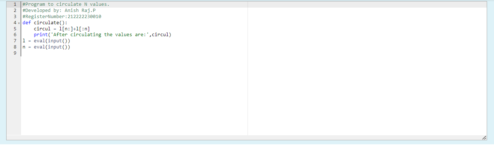
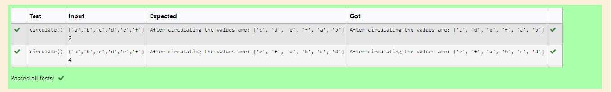

# Circulate-the-values-of-N-variables
## Aim:
To write a python program to circulate the n variables using function concept
## Equipment’s required:
PC
Anaconda - Python 3.7
## Algorithm: 
### Step 1: 
Import def circulate

### Step 2: 
Prepare the lists form linear equations

### Step 3: 
Get the value from the user for the number of rotation
### Step 4: 
Using the slicing concept rotate the list

### Step 5: 
Print the value it would be circulated

### Step 6: 
End the program
## Program:
```
#Program to circulate N values.
#Developed by: Anish Raj.P
#RegisterNumber:212222230010
def circulate():
    circul = l[n:]+l[:n]        
    print('After circulating the values are:',circul)
l = eval(input())
n = eval(input())  

```
## Output:




## Result:
Thus the program is executed successfully
